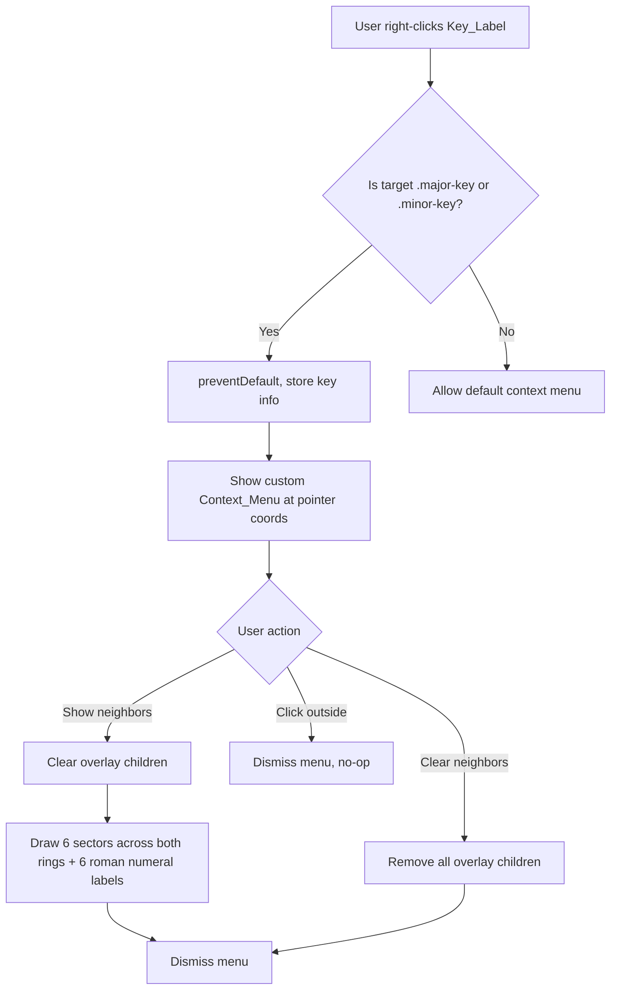

# Design Document: Context Menu Neighbors

## Overview

This feature replaces the current direct-highlight right-click behavior on key labels with a two-step interaction: right-click opens a custom context menu, and the user explicitly chooses "Show neighbors" or "Clear neighbors." The overlay highlights 6 sectors across both rings (outer/major and inner/minor) and includes roman numeral annotations showing full diatonic scale degree relationships (I/IV/V/ii/iii/vi for major keys, i/iv/v/III/VI/VII for minor keys).

The implementation stays within the existing vanilla JS architecture — no frameworks, no build tools. All changes land in `circle_of_fifths.page.js` (interaction logic) and `circle_of_fifths.html` (CSS for the menu). The SVG generator (`circle_of_fifths.js`) remains untouched.

### Key Design Decisions

1. **Custom HTML menu over SVG foreignObject** — A positioned `<div>` in the HTML body is simpler to style, dismiss, and position than an SVG-embedded element. It also avoids SVG coordinate-to-screen coordinate conversion issues.
2. **Event delegation retained** — A single `contextmenu` listener on the SVG element checks `event.target.classList` for `major-key` or `minor-key`, matching the existing pattern.
3. **Overlay not modified on right-click** — The current code clears and redraws on every right-click. The new behavior defers modification until the user picks a menu action.
4. **Roman numerals as SVG `<text>` inside the overlay group** — They share the same `<g class="neighbor-overlay">` container, so clearing the overlay removes labels and sectors in one operation.
5. **Dual-ring highlighting** — Both the outer ring (major keys) and inner ring (minor keys) are highlighted for the 3 slice positions, showing all 6 diatonic neighbors.
6. **Tonic differentiation via opacity** — The selected key's sector renders at full opacity while neighbor sectors render at reduced opacity (0.45), providing visual distinction without additional UI elements.
7. **Exact radii from layout** — Sectors use the exact circle boundaries (outerRadius/middleRadius/innerRadius) with no arbitrary padding, ensuring pixel-perfect alignment with the ring borders.

## Architecture



### File Responsibilities

| File | Role |
|------|------|
| `circle_of_fifths.html` | Hosts the context menu `<div>`, CSS for menu styling and disabled state |
| `circle_of_fifths.page.js` | Event handling, menu show/hide, overlay drawing with roman numerals |
| `circle_of_fifths.js` | SVG generation (unchanged) |

## Components and Interfaces

### 1. Context Menu DOM Element

A hidden `<div id="ctx-menu">` appended to the HTML body (inside `.card`), containing two `<button>` elements.

```html
<div id="ctx-menu" class="ctx-menu" hidden>
  <button data-action="show" class="ctx-menu-item">Show neighbors</button>
  <button data-action="clear" class="ctx-menu-item">Clear neighbors</button>
</div>
```

### 2. Module Functions (circle_of_fifths.page.js)

| Function | Signature | Purpose |
|----------|-----------|---------|
| `showContextMenu(x, y, keyInfo)` | `(number, number, {index, type}) → void` | Positions and reveals the menu; enables/disables "Clear" based on overlay state |
| `hideContextMenu()` | `() → void` | Hides the menu |
| `handleShowNeighbors(keyInfo)` | `({index, type}) → void` | Clears overlay, draws 6 sectors (3 per ring) + 6 roman numeral labels |
| `handleClearNeighbors()` | `() → void` | Removes all overlay children |
| `addRomanNumeralLabel(index, numeral, type, ring)` | `(number, string, 'major'\|'minor', 'outer'\|'inner') → void` | Creates an SVG `<text>` element positioned in the top-right corner of the sector |
| `getNeighborDegrees(type)` | `('major'\|'minor') → {outer: {self, cw, ccw}, inner: {self, cw, ccw}}` | Returns full scale degree mapping for both rings |
| `addNeighborSectorByIndex(index, options)` | `(number, {type, ring, isTonic}) → void` | Draws a single sector arc on the specified ring with opacity based on isTonic |
| `resolveKeyIndex(target)` | `(SVGTextElement) → number` | Determines the slice index from a clicked label element |

### 3. Event Wiring

- **`contextmenu` on SVG** — Delegates to `showContextMenu` when target is a key label.
- **`click` on `#ctx-menu` buttons** — Routes to `handleShowNeighbors` or `handleClearNeighbors`.
- **`click` on `document`** — Dismisses menu if click is outside `#ctx-menu`.
- **`contextmenu` on SVG while menu is open** — Dismisses old menu, opens new one (natural re-entry through the same handler).

## Data Models

### KeyInfo Object

Passed between functions to describe the right-clicked key:

```js
{
  index: 0,        // 0–11, slice index in the circle (0 = C/DO at top)
  type: 'major'    // 'major' | 'minor'
}
```

### Numeral Mapping

Static lookup — full diatonic scale degree mapping for both rings:

```js
const NEIGHBOR_DEGREES = {
  major: {
    outer: { self: 'I', cw: 'V', ccw: 'IV' },
    inner: { self: 'vi', cw: 'iii', ccw: 'ii' }
  },
  minor: {
    outer: { self: 'III', cw: 'VII', ccw: 'VI' },
    inner: { self: 'i', cw: 'v', ccw: 'iv' }
  }
};
```

- `cw` = clockwise neighbor = (index + 1) mod 12 = dominant direction
- `ccw` = counter-clockwise neighbor = (index − 1 + 12) mod 12 = subdominant direction
- `outer` = degrees for the outer ring (major keys)
- `inner` = degrees for the inner ring (minor keys)

### Sector Geometry

Each sector arc spans 30° centered on the slice angle. Two ring types:
- **Outer ring**: from `middleRadius` (215) to `outerRadius` (320)
- **Inner ring**: from `innerRadius` (110) to `middleRadius` (215)

No padding is applied — sectors use exact circle boundaries.

### Tonic Differentiation

The selected key's sector renders at `opacity: 1.0`. All 5 neighbor sectors render at `opacity: 0.45`. The `fade-in` animation starts from `opacity: 0` and animates to the element's natural opacity (not hardcoded to 1).

### Roman Numeral Label Position

Each label is placed in the top-right corner of its sector:
- **Angle**: slice center angle + 10° clockwise = `−90 + index × 30 + 10` degrees
- **Radius**: 18px inward from the outer boundary of the ring
  - Outer ring: `outerRadius − 18` = 302
  - Inner ring: `middleRadius − 18` = 197
- **Font size**: 15px for outer ring, 13px for inner ring

## Correctness Properties

*A property is a characteristic or behavior that should hold true across all valid executions of a system — essentially, a formal statement about what the system should do. Properties serve as the bridge between human-readable specifications and machine-verifiable correctness guarantees.*

### Property 1: Clear-button disabled state reflects overlay emptiness

*For any* state of the Neighbor_Overlay (0 or more children), when the Context_Menu is displayed, the "Clear neighbors" button's disabled attribute SHALL equal `(overlay.children.length === 0)`.

**Validates: Requirements 1.3, 1.4, 5.3**

### Property 2: Right-click preserves overlay state

*For any* Neighbor_Overlay state (empty or populated) and *for any* Key_Label, right-clicking that label SHALL NOT change the number or content of the Neighbor_Overlay's child elements.

**Validates: Requirements 1.7, 4.3**

### Property 3: Show neighbors produces exactly 12 overlay children

*For any* key index (0–11), *for any* key type (major or minor), and *for any* prior overlay state, after executing "Show neighbors" the Neighbor_Overlay SHALL contain exactly 12 child elements: 6 `<path>` elements (sectors) and 6 `<text>` elements (roman numerals).

**Validates: Requirements 2.1, 3.1, 3.2**

### Property 4: Sector highlight class matches key type

*For any* key index and key type, after "Show neighbors", all 6 sector `<path>` elements SHALL have the class `highlight-major fade-in` when type is major, or `highlight-minor fade-in` when type is minor.

**Validates: Requirements 2.4, 2.5, 2.6**

### Property 5: Roman numerals match key type and neighbor position

*For any* key index N and key type, after "Show neighbors":
- For major: outer ring text elements contain "I", "V", "IV"; inner ring text elements contain "vi", "iii", "ii"
- For minor: inner ring text elements contain "i", "v", "iv"; outer ring text elements contain "III", "VII", "VI"

**Validates: Requirements 3.1, 3.2**

### Property 6: Roman numeral label positioning

*For any* key index, each Roman_Numeral_Label's x and y coordinates SHALL equal the point at angle `(−90 + index × 30 + 10)` degrees and radius `outerRadius − 18` (outer ring) or `middleRadius − 18` (inner ring), within a tolerance of ±1px.

**Validates: Requirements 3.3**

### Property 7: Tonic sector opacity differentiation

*For any* key index and key type, after "Show neighbors", exactly 1 sector `<path>` element SHALL have `style.opacity === '1'` (the tonic) and exactly 5 sector `<path>` elements SHALL have `style.opacity === '0.45'` (the neighbors).

**Validates: Requirements 2.7**

### Property 8: Clearing overlay removes all children but retains the group

*For any* Neighbor_Overlay state with 1 or more children, after executing "Clear neighbors", the `<g class="neighbor-overlay">` element SHALL exist in the DOM with exactly 0 child elements.

**Validates: Requirements 3.6, 5.1, 5.2**

### Property 9: Any key label triggers the context menu

*For any* SVG text element with class `major-key` or `minor-key`, dispatching a `contextmenu` event on that element SHALL result in the custom Context_Menu becoming visible and the default browser context menu being suppressed.

**Validates: Requirements 6.1, 6.2**

## Error Handling

This feature operates entirely in the browser DOM with no network calls or async operations. Error scenarios are minimal:

| Scenario | Handling |
|----------|----------|
| SVG not yet rendered when right-click fires | Guard: `if (!svg) return;` — allow default context menu |
| Overlay `<g>` missing from DOM | `createNeighborOverlay(svg)` lazily creates it (existing pattern) |
| Key label text doesn't match any slice | `resolveKeyIndex` returns `-1`; menu is not shown |
| Menu positioned partially off-screen | CSS `position: fixed` with clamping to viewport bounds via `Math.min(x, window.innerWidth - menuWidth)` |
| Multiple rapid right-clicks | Each invocation dismisses the previous menu first (idempotent) |

No exceptions are thrown to the user. All failures degrade gracefully to "do nothing" or "show default browser menu."

## Testing Strategy

### Unit Tests (example-based)

- Menu contains exactly 2 items with correct text and order (Req 1.2)
- Click outside dismisses menu (Req 1.5)
- Re-right-click replaces menu at new coordinates (Req 1.6)
- Sector path geometry uses exact radii (outer: 320→215, inner: 215→110) (Req 2.8)
- Roman numeral text elements have correct font-size (15px outer, 13px inner), text-anchor, dominant-baseline (Req 3.4)
- Tonic sector has opacity 1.0, neighbors have opacity 0.45 (Req 2.7)
- Right-click on non-label SVG area does not suppress default menu (Req 6.3)
- Single event listener attached via delegation (Req 6.4)
- Major key shows I/IV/V on outer ring and vi/ii/iii on inner ring (Req 3.1)
- Minor key shows i/iv/v on inner ring and III/VI/VII on outer ring (Req 3.2)

### Property-Based Tests

**Library**: [fast-check](https://github.com/dubzzz/fast-check) (JavaScript PBT library)

**Configuration**: Minimum 100 iterations per property.

Each property test will use arbitraries for:
- `keyIndex`: `fc.integer({min: 0, max: 11})`
- `keyType`: `fc.constantFrom('major', 'minor')`
- `priorOverlayChildren`: `fc.integer({min: 0, max: 20})` (to simulate various prior states)

**Tag format**: `Feature: context-menu-neighbors, Property {N}: {title}`

| Property | What it tests | Generators |
|----------|---------------|------------|
| 1 | Clear-button disabled ↔ overlay empty | keyIndex, keyType, priorChildren |
| 2 | Right-click preserves overlay | keyIndex, keyType, priorChildren |
| 3 | Show neighbors → 12 children (6 paths + 6 texts) | keyIndex, keyType, priorChildren |
| 4 | Sector class matches type | keyIndex, keyType |
| 5 | Roman numerals correct for both rings | keyIndex, keyType |
| 6 | Label positioning (top-right corner) | keyIndex |
| 7 | Tonic opacity 1.0, neighbors 0.45 | keyIndex, keyType |
| 8 | Clear removes all children | keyIndex, keyType, priorChildren |
| 9 | Any key label triggers menu | keyIndex, keyType |

### Integration Tests

- Full user flow: right-click → menu → "Show neighbors" → verify visual output → right-click another → "Clear neighbors" → verify clean state
- Verify overlay survives `updateSvgCode()` calls (textarea sync doesn't break overlay)

### Test Environment

Tests run in a JSDOM or happy-dom environment (via Vitest) to simulate the DOM. The SVG is rendered via `renderCircleOfFifths` before each test suite.

