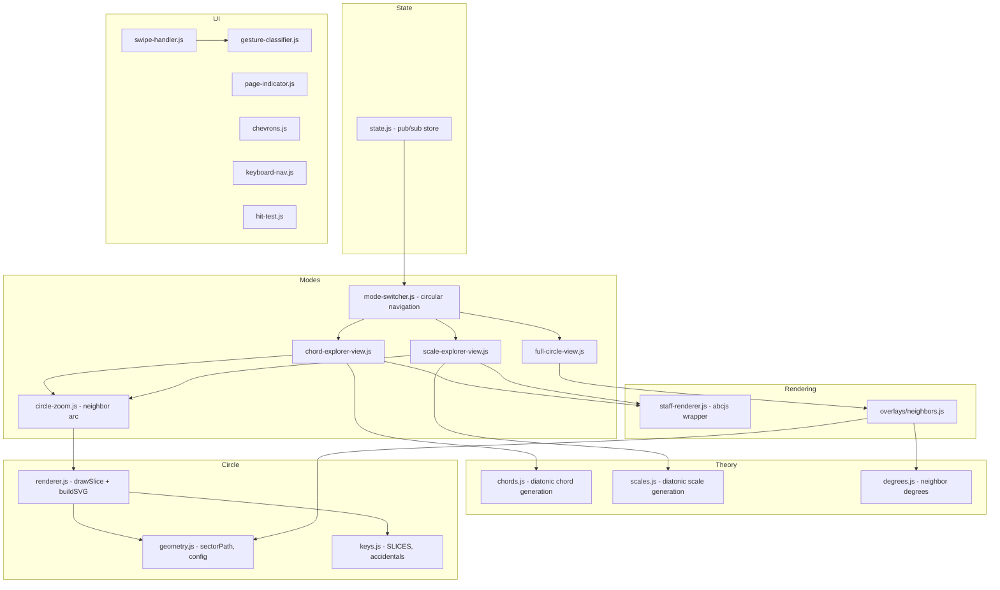

# Design Document: Key Explorer Modes

## Overview

This feature transforms the Circle of Fifths app into a three-mode exploration system with circular navigation. Users cycle between Full Circle (neighbors), Chord Explorer (diatonic triads/sevenths), and Scale Explorer (major/minor scales) via swipe, keyboard, or chevrons.

The architecture uses vanilla JS modules with a pub/sub state store, a reusable `drawSlice()` SVG rendering routine, and abcjs for music notation. The mode system wraps the existing neighbor overlay as "mode 0" and adds two new views for chords and scales.

### Key Design Decisions

1. **Reusable `drawSlice()` routine** — A single function draws any slice of the circle at any angular position, with configurable visibility (major/minor rings, staff, leading tones, backgrounds). Used by both the full circle and the zoomed neighbor arc.
2. **abcjs for music notation** — Proper engraving of clefs, key signatures, noteheads, and accidentals. Labels attached via ABC `w:` lines for perfect alignment.
3. **Staff-position-based ABC conversion** — Scale/chord notes are converted to ABC notation using staff positions directly (not chromatic pitch), eliminating octave bugs.
4. **Proper diatonic spelling** — Scale and chord generation uses letter-name-based spelling (each degree uses the next letter with appropriate accidental), avoiding enharmonic duplicates.
5. **Circular navigation** — Mode transitions wrap around (Scales→Full Circle, Full Circle→Scales) using modulo arithmetic.
6. **CSS transform transitions** — Mode panels in a horizontal track, translated via `translateX()` with 300ms ease.

## Architecture



## Components and Interfaces

### `src/circle/renderer.js` — drawSlice

```javascript
/**
 * Draw a single slice of the circle at a given angular position.
 * @param {Object} options
 * @param {number} options.sliceIndex - Which SLICES[] entry (0-11)
 * @param {number} options.position - Angular position (0=top, 1=+30°, -1=-30°)
 * @param {Object} options.config - Geometry config
 * @param {Object} options.show - Visibility flags:
 *   { major, minor, majorBg, minorBg, staff, radialLine, leadingTones, background }
 * @returns {string} SVG markup
 */
export function drawSlice({ sliceIndex, position, config, show }) { ... }
```

### `src/modes/circle-zoom.js`

```javascript
/**
 * Build a partial circle showing only the diatonic neighborhood.
 * Uses drawSlice() for each visible slice.
 * @param {{ index: number, type: 'major'|'minor' }} activeKey
 * @returns {HTMLElement} Container with the zoomed SVG
 */
export function renderCircleZoom(activeKey) { ... }
```

### `src/modes/staff-renderer.js` — abcjs wrapper

```javascript
/**
 * Render chords using abcjs with w: labels.
 * Converts staff positions directly to ABC octave notation.
 */
export function renderChordStaff(container, { sliceIndex, keyType, chords, labels }) { ... }

/**
 * Render a scale using abcjs with w: labels.
 */
export function renderScaleStaff(container, { sliceIndex, keyType, scale, noteLabels }) { ... }
```

### `src/theory/scales.js`

```javascript
/**
 * Generate a scale with proper diatonic spelling.
 * Each degree uses the next letter name with appropriate accidental.
 * Staff positions: A=-2, B=-1, C=0, D=1, E=2, F=3, G=4 (ascending).
 */
export function getScale(keyIndex, keyType, scaleType) { ... }
```

### `src/theory/chords.js`

```javascript
/**
 * Generate diatonic triads/sevenths with proper root spelling.
 * Root names computed from tonic letter + scale degree offset.
 */
export function getDiatonicTriads(keyIndex, keyType) { ... }
export function getDiatonicSevenths(keyIndex, keyType) { ... }
```

## Data Models

### State Keys

| Key | Type | Default | Description |
|-----|------|---------|-------------|
| `activeKey` | `{ index, type }` | `{ index: 0, type: 'major' }` | Currently selected key |
| `currentMode` | `number` | `0` | Active mode (0=Circle, 1=Chords, 2=Scales) |
| `isTransitioning` | `boolean` | `false` | Animation guard |

### drawSlice show options

| Flag | Default | Description |
|------|---------|-------------|
| `major` | true | Draw major ring key name + leading tone |
| `minor` | true | Draw minor ring key name + leading tone |
| `majorBg` | =major | Draw outer ring background sector |
| `minorBg` | =minor | Draw inner ring background sector |
| `staff` | true | Draw staff with clef + accidentals |
| `radialLine` | true | Draw left boundary line |
| `leadingTones` | true | Draw leading tone labels |
| `background` | true | Draw ring background sectors |

## Overlay Colors

- **Outer ring (major keys)**: `rgba(139, 0, 0, 0.25)` — red, matching legend "Majeur"
- **Inner ring (minor keys)**: `rgba(46, 107, 46, 0.22)` — green, matching legend "Mineur"
- **Tonic sector**: opacity 1
- **Neighbor sectors**: opacity 0.45
- Roman numeral labels: red (#8B0000) for outer ring, green (#2E6B2E) for inner ring

## Dependencies

- **abcjs** — Music notation rendering (clefs, key signatures, noteheads, lyrics/labels)
- **fast-check** — Property-based testing (dev)
- **vitest** — Test runner (dev)
- **vite** — Bundler
