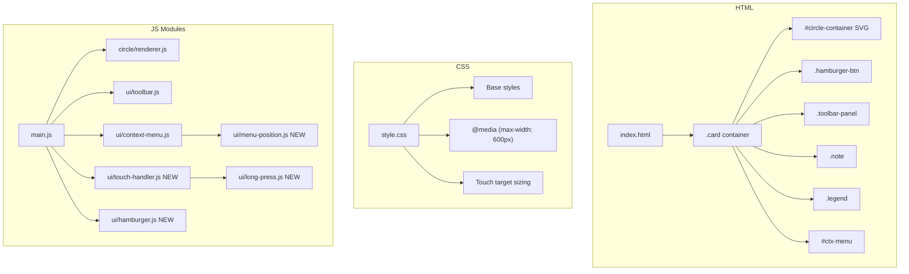
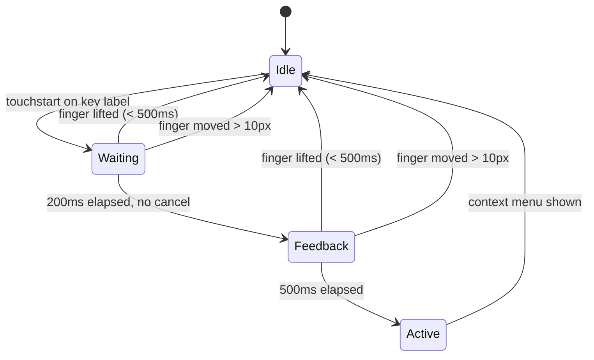
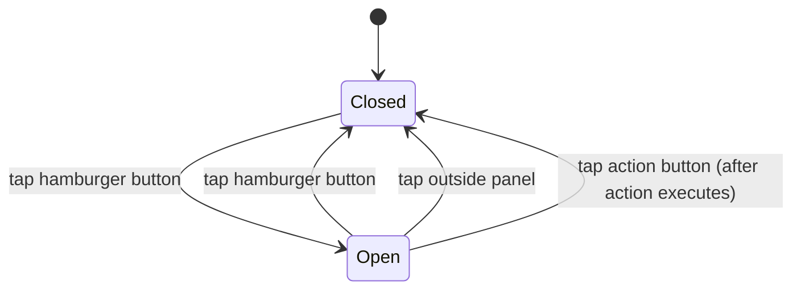

# Design Document: Mobile Responsive UI

## Overview

This design transforms the Circle of Fifths application from a fixed-size desktop-only layout into a fully responsive, touch-friendly web application. The current implementation renders a hardcoded 980×980px SVG with no media queries, no touch support, and a toolbar that uses inline buttons with a now-unnecessary "Show SVG Code" feature.

The redesign introduces:
- CSS-based responsive scaling using `viewBox` and fluid container sizing
- A universal hamburger menu replacing inline toolbar buttons
- Long-press gesture detection for touch-based context menu activation
- Viewport-aware context menu positioning with clamping logic
- Touch event management to prevent unintended zoom/scroll on the SVG
- Responsive typography and spacing via CSS media queries
- A persistent legend area below the circle

**Key design decision:** All responsive layout is handled via CSS (media queries, flexbox, percentage widths). Interactive behavior (long-press, hamburger toggle, touch prevention) is handled in JavaScript modules. No framework is introduced — the app remains vanilla JS with ES modules.

## Architecture



### Module Responsibilities

| Module | Responsibility |
|--------|---------------|
| `ui/long-press.js` | Long-press gesture detection (timing, distance threshold, visual feedback) |
| `ui/touch-handler.js` | SVG container touch event management (prevent zoom/scroll) |
| `ui/hamburger.js` | Hamburger menu button toggle and outside-click dismissal |
| `ui/menu-position.js` | Pure function for clamping menu position within viewport |
| `ui/context-menu.js` | Updated to use `menu-position.js` and integrate long-press trigger |
| `ui/toolbar.js` | Simplified: only save/print actions, no toggle-code |
| `circle/renderer.js` | Updated SVG to use `viewBox` instead of fixed width/height attributes |

## Components and Interfaces

### 1. SVG Responsive Scaling (renderer.js changes)

The SVG element currently uses fixed `width="980" height="980"` attributes. The change:

```javascript
// Before
parts.push(`<svg width="${width}" height="${height}" xmlns="http://www.w3.org/2000/svg">`);

// After — use viewBox for intrinsic scaling, let CSS control rendered size
parts.push(`<svg viewBox="0 0 ${width} ${height}" xmlns="http://www.w3.org/2000/svg">`);
```

CSS handles the rendered size:
```css
#circle-container svg {
  width: 100%;
  height: auto;
  max-width: 980px;
  display: block;
  margin: 0 auto;
}
```

### 2. Menu Position Clamping (ui/menu-position.js) — NEW

A pure utility module for computing clamped menu positions:

```javascript
/**
 * @typedef {Object} MenuDimensions
 * @property {number} width - Menu element width in px
 * @property {number} height - Menu element height in px
 */

/**
 * @typedef {Object} ViewportDimensions
 * @property {number} width - Viewport width in px
 * @property {number} height - Viewport height in px
 */

/**
 * @typedef {Object} Position
 * @property {number} x - Left offset in px
 * @property {number} y - Top offset in px
 */

/**
 * @typedef {Object} ClampedResult
 * @property {number} x - Clamped left offset
 * @property {number} y - Clamped top offset
 * @property {number} maxHeight - Maximum allowed height (viewport.height - 2*inset)
 * @property {boolean} needsScroll - Whether menu needs vertical scrolling
 */

const INSET = 8;

/**
 * Clamp a menu position so all edges remain at least `inset` px inside the viewport.
 * @param {Position} desired - Desired top-left position
 * @param {MenuDimensions} menu - Menu dimensions
 * @param {ViewportDimensions} viewport - Viewport dimensions
 * @param {number} [inset=8] - Minimum distance from viewport edges
 * @returns {ClampedResult}
 */
export function clampMenuPosition(desired, menu, viewport, inset = INSET) {
  const maxWidth = viewport.width - 2 * inset;
  const maxHeight = viewport.height - 2 * inset;
  const effectiveWidth = Math.min(menu.width, maxWidth);
  const effectiveHeight = Math.min(menu.height, maxHeight);

  let x = Math.max(inset, Math.min(desired.x, viewport.width - effectiveWidth - inset));
  let y = Math.max(inset, Math.min(desired.y, viewport.height - effectiveHeight - inset));

  return {
    x,
    y,
    maxHeight,
    needsScroll: menu.height > maxHeight
  };
}

/**
 * Compute context menu width constraints for a given viewport width.
 * @param {number} viewportWidth
 * @param {number} breakpoint - Small breakpoint (default 600)
 * @returns {{ minWidth: number, maxWidth: number }}
 */
export function getMenuWidthConstraints(viewportWidth, breakpoint = 600) {
  if (viewportWidth <= breakpoint) {
    return {
      minWidth: 180,
      maxWidth: viewportWidth - 16
    };
  }
  return {
    minWidth: 160,
    maxWidth: Infinity
  };
}
```

### 3. Long-Press Gesture Detection (ui/long-press.js) — NEW

```javascript
/**
 * @typedef {Object} LongPressConfig
 * @property {number} threshold - Time in ms to trigger (default 500)
 * @property {number} moveThreshold - Max movement in px before cancel (default 10)
 * @property {number} feedbackDelay - Time in ms before visual feedback (default 200)
 * @property {function} onLongPress - Callback when long-press completes
 * @property {function} onFeedbackStart - Callback when visual feedback should begin
 * @property {function} onCancel - Callback when gesture is cancelled
 */

/**
 * Compute Euclidean distance between two points.
 * @param {{ x: number, y: number }} a
 * @param {{ x: number, y: number }} b
 * @returns {number}
 */
export function distance(a, b) {
  return Math.sqrt((b.x - a.x) ** 2 + (b.y - a.y) ** 2);
}

/**
 * Determine if a movement exceeds the long-press cancellation threshold.
 * @param {{ x: number, y: number }} start - Initial touch point
 * @param {{ x: number, y: number }} current - Current touch point
 * @param {number} [threshold=10] - Maximum allowed movement in px
 * @returns {boolean} True if movement exceeds threshold (gesture should cancel)
 */
export function exceedsMovementThreshold(start, current, threshold = 10) {
  return distance(start, current) > threshold;
}

/**
 * Attach long-press detection to an element.
 * Returns a cleanup function to remove listeners.
 */
export function attachLongPress(element, config) { /* ... */ }
```

### 4. Touch Handler (ui/touch-handler.js) — NEW

```javascript
/**
 * Attach touch event handlers to the SVG container to prevent
 * unintended zoom and scroll during touch interactions.
 * 
 * Rules:
 * - Single touch within SVG: prevent default scroll/bounce
 * - Multi-touch (2+) within SVG: prevent pinch-to-zoom
 * - Touch outside SVG: allow normal scrolling
 * 
 * @param {Element} svgContainer - The #circle-container element
 * @returns {function} Cleanup function to remove listeners
 */
export function attachTouchHandlers(svgContainer) { /* ... */ }
```

### 5. Hamburger Menu (ui/hamburger.js) — NEW

```javascript
/**
 * Initialize the hamburger menu button and toolbar panel.
 * - Toggle panel visibility on button tap
 * - Close panel on outside tap
 * - Close panel after action button execution
 * 
 * @returns {function} Cleanup function
 */
export function attachHamburgerMenu() { /* ... */ }
```

### 6. Updated Context Menu (ui/context-menu.js)

The existing `showContextMenu` function will be updated to use `clampMenuPosition` from `menu-position.js`. The module will also integrate with `long-press.js` for touch activation while preserving right-click support.

### 7. Updated Toolbar (ui/toolbar.js)

Remove the `btn-toggle-code` handler. Only `saveSVG` and `printCircle` remain. These are now triggered from the hamburger panel buttons.

## Data Models

### Long-Press State Machine



| State | Visual | Behavior |
|-------|--------|----------|
| Idle | Normal | No gesture in progress |
| Waiting | Normal | Touch started, timer running, no feedback yet |
| Feedback | Highlight on label | 200ms passed, visual cue active |
| Active | Menu appears | 500ms passed, long-press recognized |

### Hamburger Panel State



### CSS Breakpoint Strategy

| Viewport Width | Card Padding | Card Width | SVG Width | Font Adjustments |
|---|---|---|---|---|
| > 1040px | 24px | max 1040px, centered | max 980px | Base sizes |
| 601px – 1040px | 24px | 100% | 100% of card content | Base sizes |
| ≤ 600px | 12px | 100vw - 16px | 100% of card content | .note/.legend: 14px min, line-height 1.3 |

## Correctness Properties

*A property is a characteristic or behavior that should hold true across all valid executions of a system — essentially, a formal statement about what the system should do. Properties serve as the bridge between human-readable specifications and machine-verifiable correctness guarantees.*

### Property 1: Viewport containment clamping

*For any* desired position (x, y), menu dimensions (width, height), and viewport dimensions (vw, vh), the clamped position returned by `clampMenuPosition` SHALL satisfy: `result.x >= 8`, `result.y >= 8`, `result.x + effectiveWidth <= vw - 8`, and `result.y + effectiveHeight <= vh - 8`, where effectiveWidth and effectiveHeight are bounded by the viewport minus 2×inset.

**Validates: Requirements 3.1, 7.1, 7.2**

### Property 2: Long-press distance cancellation

*For any* two points (start, current) in 2D space, `exceedsMovementThreshold(start, current, 10)` SHALL return `true` if and only if the Euclidean distance between start and current is strictly greater than 10.

**Validates: Requirements 3.3**

### Property 3: Context menu width constraints at small viewport

*For any* viewport width `vw` where `vw <= 600`, `getMenuWidthConstraints(vw)` SHALL return `minWidth = 180` and `maxWidth = vw - 16`. For any viewport width `vw > 600`, `minWidth` SHALL be 160 and `maxWidth` SHALL be `Infinity`.

**Validates: Requirements 7.3**

### Property 4: Context menu height overflow detection

*For any* menu height `mh` and viewport height `vh`, `clampMenuPosition` SHALL set `needsScroll = true` if and only if `mh > vh - 16`, and `maxHeight` SHALL equal `vh - 16`.

**Validates: Requirements 7.4**

## Error Handling

| Scenario | Handling |
|----------|----------|
| Long-press on non-label element | Gesture detection only attaches to `.major-key` and `.minor-key` elements; other touches are ignored |
| Context menu position with very small viewport (320px) | Clamping function handles edge cases; menu width constrained to viewport - 16px minimum |
| Touch events on browsers without touch support | Touch handlers use feature detection; mouse/pointer events remain functional |
| Hamburger panel open during orientation change | Panel closes on resize event; re-positions on next open |
| SVG container not found in DOM | `attachTouchHandlers` returns no-op cleanup if container is null |
| Multiple rapid hamburger taps | State is toggled synchronously; no debounce needed since it's a simple boolean flip |

## Testing Strategy

### Unit Tests (vitest)

Focus on specific examples and edge cases:

- **Long-press timing**: Mock timers to verify gesture states at 0ms, 200ms, 499ms, 500ms
- **Touch handler**: Verify `preventDefault` is called for SVG touches, not called for outside touches
- **Hamburger toggle**: Verify panel open/close state transitions
- **Context menu integration**: Verify long-press triggers menu, right-click still works
- **Removal verification**: Confirm no references to `btn-toggle-code`, `svgCodeArea` in source

### Property-Based Tests (vitest + fast-check)

Property-based testing is appropriate for this feature because the menu positioning and gesture detection modules contain pure functions with clear input/output behavior where input variation reveals edge cases (extreme viewport sizes, positions near boundaries, floating-point coordinates).

**Configuration:**
- Library: `fast-check` (already in devDependencies)
- Minimum 100 iterations per property test
- Each test tagged with: **Feature: mobile-responsive-ui, Property {N}: {title}**

**Properties to implement:**
1. Viewport containment clamping — generates random positions, menu sizes, viewport sizes
2. Long-press distance cancellation — generates random 2D point pairs
3. Context menu width constraints — generates random viewport widths
4. Context menu height overflow detection — generates random menu/viewport heights

### Integration Tests

Browser-based tests (manual or Playwright if added later):
- No horizontal scrollbar at viewport widths 320px, 375px, 414px, 768px, 1024px, 1920px
- SVG scales proportionally at each breakpoint
- Legend remains visible at all widths
- Touch interactions work on mobile devices

### CSS Verification

Static checks that can be automated:
- No `font-size` below 12px in any CSS rule
- Viewport meta tag does not contain `user-scalable=no` or `maximum-scale=1`
- Media query at 600px breakpoint exists with correct property values
