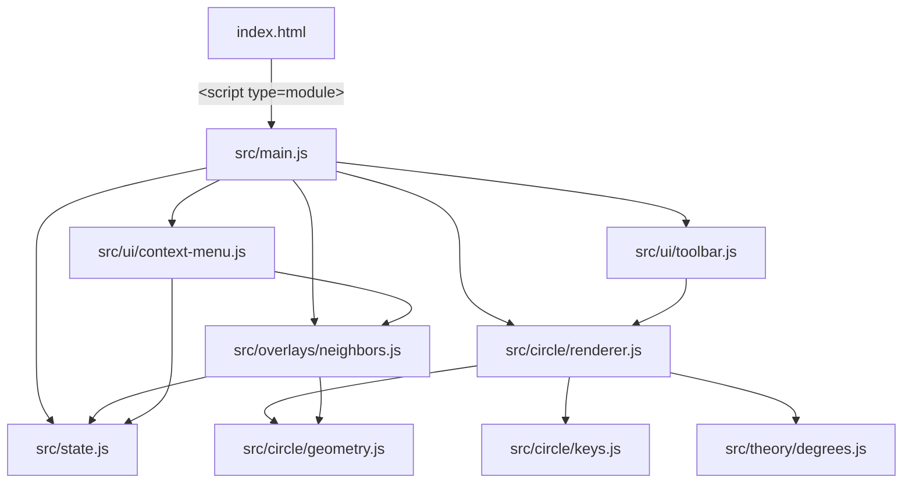

# Design Document: Vite Migration

## Overview

This design describes the migration of the Circle of Fifths application from a flat, script-tag-loaded architecture to a Vite-based ES module project. The migration preserves all existing functionality while introducing a modular file structure, a minimal reactive state module, and standard npm development workflows.

The approach is incremental decomposition: extract logical units from the two existing JS files into focused modules under `src/`, wire them together through ES imports, and let Vite handle bundling and dev serving.

### Key Design Decisions

1. **No framework** — DOM manipulation stays as-is, using string concatenation for SVG and direct DOM API for interactions.
2. **Minimal state module** — A ~30-line pub/sub store provides reactive state without external dependencies. This enables future features (mode overlays, modulation routes) to subscribe to key selection changes.
3. **Vite vanilla template** — No plugins beyond Vite's built-in HTML/JS handling. CSS stays in a single file imported from `main.js`.
4. **Preserve SVG generation approach** — The string-concatenation SVG builder moves intact into `circle/renderer.js`; only the export mechanism changes.

## Architecture



### Module Dependency Flow

- `main.js` is the single entry point. It imports all top-level modules, calls `renderCircle()`, and attaches event listeners.
- `state.js` has zero imports — it's a leaf dependency used by overlays and UI modules.
- `circle/renderer.js` depends on `circle/geometry.js` and `circle/keys.js` for data and math.
- `overlays/neighbors.js` depends on `circle/geometry.js` for sector path calculations and `state.js` for current key info.
- `ui/context-menu.js` orchestrates overlay show/clear actions.
- `ui/toolbar.js` handles print, save, and toggle-code buttons.
- `theory/degrees.js` exports the neighbor degree mappings (pure data).

### Build Pipeline

```
src/ → Vite dev server (HMR) → browser
src/ → Vite build → dist/ (static HTML + hashed JS/CSS)
```

Vite's default configuration handles:
- ES module bundling and tree-shaking
- CSS injection via JS import
- HTML entry point processing
- Content-hashed filenames for cache busting

## Components and Interfaces

### src/state.js — Reactive State Module

```javascript
// Public API
export function get(key)                    // → current value or undefined
export function set(key, value)             // → void; notifies subscribers if value changed
export function subscribe(key, callback)    // → unsubscribe function
```

Internal structure: a `Map<string, { value: any, listeners: Set<Function> }>`.

State keys used by the application:
- `selectedKeyIndex` — `number | null`
- `overlayActive` — `boolean`
- `overlayType` — `"major" | "minor"`

### src/circle/keys.js — Key Data

```javascript
export const SLICES           // Array<{major, minor, accidentals, enharmonic}>
export const SHARPS_ORDER     // Array<{name, pitch, y}>
export const FLATS_ORDER      // Array<{name, pitch, y}>
export const LEADING_TONE_MAP // Record<string, string>
export function getLeadingTone(tonic, isMajor)  // → string
```

### src/circle/geometry.js — Geometry Calculations

```javascript
export const DEFAULT_CONFIG   // {width, height, centerX, centerY, ...radii}
export function getAngles(count)              // → number[] (radians)
export function getPositions(config)          // → Array<{major, minor, staff}>
export function sectorPath(cx, cy, innerR, outerR, startDeg, endDeg) // → SVG path d string
```

### src/circle/renderer.js — SVG Builder

```javascript
export function buildSVG(options?)       // → string (complete SVG markup)
export function renderCircle(containerId, options?)  // → void (sets innerHTML)
export function getCircleLayout(options?) // → layout object for overlays
```

### src/overlays/neighbors.js — Neighbor Overlay

```javascript
export function showNeighbors(keyInfo)   // → void (draws sectors + labels)
export function clearNeighbors()         // → void (removes overlay children)
export function createOverlay(svg)       // → SVGGElement
```

### src/theory/degrees.js — Scale Degree Mappings

```javascript
export const NEIGHBOR_DEGREES  // {major: {outer, inner}, minor: {outer, inner}}
export function getNeighborDegrees(type) // → degree mapping for given key type
```

### src/ui/context-menu.js — Context Menu

```javascript
export function showContextMenu(x, y, keyInfo)  // → void
export function hideContextMenu()               // → void
export function attachContextMenuListeners()    // → void
```

### src/ui/toolbar.js — Toolbar Actions

```javascript
export function printCircle()       // → void (opens print window)
export function saveSVG()           // → void (triggers download)
export function attachToolbarListeners() // → void
```

### src/main.js — Entry Point

```javascript
import './style.css'
// imports all modules, renders circle, attaches listeners on DOMContentLoaded
```

### index.html — Vite Entry

The root `index.html` contains the static markup (card, container, toolbar buttons, context menu, textarea) and a single `<script type="module" src="/src/main.js"></script>`. No inline `onclick` attributes — all event binding happens in modules.

## Data Models

### Circle Configuration

```typescript
interface CircleConfig {
  width: number       // 980
  height: number      // 980
  centerX: number     // 490
  centerY: number     // 490
  outerRadius: number // 320
  middleRadius: number // 215
  innerRadius: number // 110
  staffRadius: number // 380
  majorRadius: number // 268
  minorRadius: number // 168
}
```

### Key Slice

```typescript
interface KeySlice {
  major: string       // e.g. "DO", "SOL♭/FA#"
  minor: string       // e.g. "la", "mi♭/ré#"
  accidentals: number // -7 to 7
  enharmonic: boolean
}
```

### Key Info (State)

```typescript
interface KeyInfo {
  index: number  // 0-11, position on the circle
  type: "major" | "minor"
}
```

### Neighbor Degrees

```typescript
interface DegreeMappings {
  major: { outer: {self, cw, ccw}, inner: {self, cw, ccw} }
  minor: { outer: {self, cw, ccw}, inner: {self, cw, ccw} }
}
```

### Application State Shape

```typescript
{
  selectedKeyIndex: number | null
  overlayActive: boolean
  overlayType: "major" | "minor"
}
```

## Correctness Properties

*A property is a characteristic or behavior that should hold true across all valid executions of a system — essentially, a formal statement about what the system should do. Properties serve as the bridge between human-readable specifications and machine-verifiable correctness guarantees.*

### Property 1: State get/set round-trip

*For any* state key (string) and any value, calling `set(key, value)` followed by `get(key)` SHALL return that same value. Additionally, *for any* key that has never been set, `get(key)` SHALL return `undefined`.

**Validates: Requirements 4.1, 4.6**

### Property 2: Unsubscribe prevents notification

*For any* state key and any subscriber callback, after calling the unsubscribe function returned by `subscribe(key, callback)`, subsequent calls to `set(key, newValue)` SHALL NOT invoke that callback.

**Validates: Requirements 4.2**

### Property 3: Subscriber notification order

*For any* state key and any sequence of N subscriber callbacks registered via `subscribe`, when `set(key, value)` is called, all N callbacks SHALL be invoked exactly once each, in the order they were registered, each receiving the new value as their argument.

**Validates: Requirements 4.3**

### Property 4: Set deduplication (idempotence)

*For any* state key and any value V, if the current value for that key is already V, calling `set(key, V)` SHALL NOT invoke any subscriber callbacks for that key.

**Validates: Requirements 4.7**

### Property 5: Neighbor overlay produces correct sectors and labels

*For any* key index (0–11) and key type ("major" or "minor"), calling `showNeighbors({index, type})` SHALL produce exactly 6 highlight sectors (3 on the tonic ring, 3 on the relative ring) at indices `[index, (index+1)%12, (index+11)%12]`, with the tonic sector at opacity 1 and neighbor sectors at opacity 0.45, and SHALL place roman numeral labels matching the degree mapping for that key type.

**Validates: Requirements 5.3**

## Error Handling

### Module Load Failure

If any ES module fails to load (network error, syntax error), the entry point wraps its initialization in a try/catch and displays a user-visible error message in the `#circle-container` element:

```javascript
try {
  renderCircle('circle-container');
  attachAllListeners();
} catch (err) {
  document.getElementById('circle-container').innerHTML =
    `<p style="color:red">Failed to load application: ${err.message}</p>`;
}
```

This satisfies Requirement 2.5.

### Missing DOM Elements

All UI modules check for element existence before operating (matching the current defensive pattern). Functions like `showContextMenu`, `clearNeighbors`, and toolbar actions return early if their target elements are not found.

### SVG Container Missing

`renderCircle()` logs an error and returns early if the container element doesn't exist, matching the current `console.error` behavior.

## Testing Strategy

### Unit Tests (Example-Based)

Use Vitest as the test runner (ships with Vite, zero extra config).

Focus areas:
- **SVG renderer output** — verify `buildSVG()` produces markup with all required elements (3 circles, 12 radial lines, 12 major labels, 12 minor labels, 24 leading tones, 12 staff groups, arrow, headers)
- **Geometry calculations** — verify `sectorPath()` produces valid SVG path strings for known inputs
- **Leading tone lookup** — verify `getLeadingTone()` returns correct values for each key
- **Context menu show/hide** — verify DOM state changes
- **Toolbar actions** — verify save triggers blob download, print opens window

### Property-Based Tests

Use **fast-check** as the property-based testing library.

Configuration:
- Minimum 100 iterations per property test
- Each test tagged with: `Feature: vite-migration, Property {N}: {title}`

Properties to implement:
1. **State get/set round-trip** — generate random key strings and arbitrary values, verify round-trip
2. **Unsubscribe prevents notification** — generate random subscribe/unsubscribe sequences, verify no calls after unsubscribe
3. **Subscriber notification order** — generate N callbacks, verify invocation order matches registration order
4. **Set deduplication** — generate random values, set twice with same value, verify single notification
5. **Neighbor overlay correctness** — generate key index (0–11) and type, verify sector count, indices, opacities, and label text

### Integration Tests

- **Build smoke test** — `npm run build` succeeds and produces `dist/index.html`
- **Static analysis** — no `window.X =` assignments in `src/`, no `require()`, no inline `onclick`
- **Cross-browser** — manual verification in Chrome, Firefox, Safari, Edge

### Test File Structure

```
src/
  __tests__/
    state.test.js          # Properties 1-4 + unit tests
    neighbors.test.js      # Property 5 + unit tests
    renderer.test.js       # Unit tests for SVG output
    geometry.test.js       # Unit tests for path calculations
    keys.test.js           # Unit tests for leading tone lookup
```

### npm Scripts

```json
{
  "scripts": {
    "dev": "vite",
    "build": "vite build",
    "preview": "vite preview",
    "test": "vitest run",
    "test:watch": "vitest"
  }
}
```

